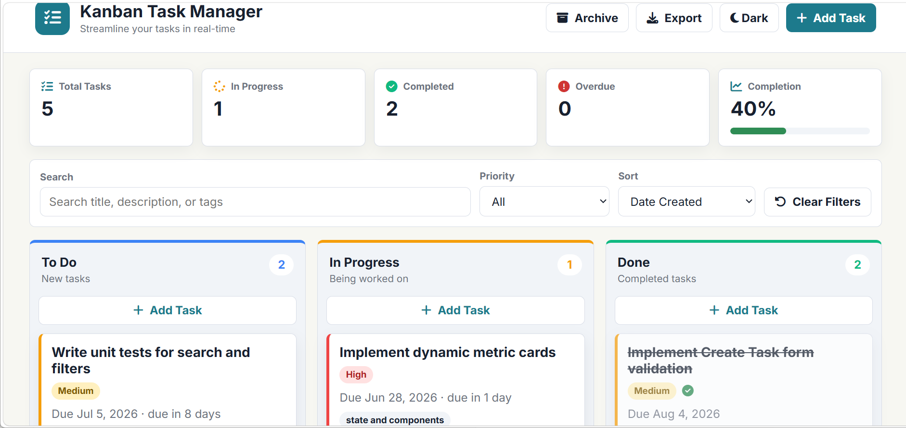
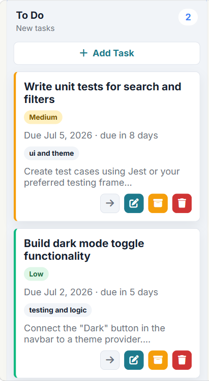
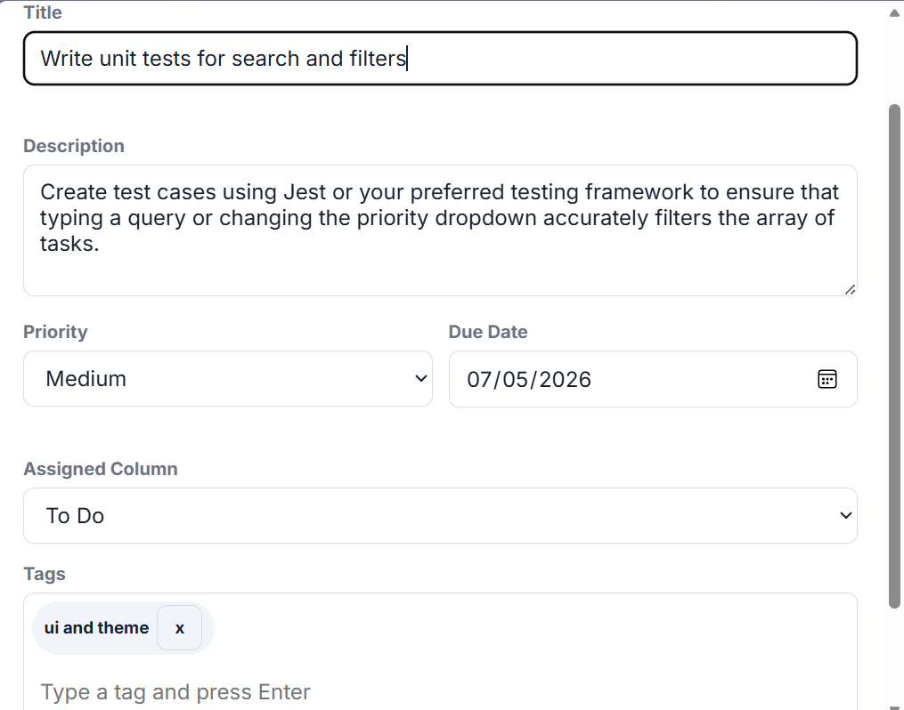

# Kanban Task Manager

A fully responsive Kanban-style task management board built with pure HTML5, CSS3, and vanilla JavaScript (ES6+). All task data is stored in localStorage and restored on page reload. The board includes task creation, editing, movement, drag and drop, filtering, sorting, real-time statistics, dark/light mode, and an archive system — with zero frameworks or libraries.

## Live Demo

🔗 [Click here to view the live demo](https://rococo-cannoli-cd79da.netlify.app/)

## Video Walkthrough

🎥 [Watch the 5-minute walkthrough ](https://www.loom.com/share/656851f783ac4883932b11af28de2b68)

## Screenshots

### Desktop Board


### Mobile Tab View


### Task Modal Open


## Features

### Core Features
- Three fixed columns: To Do, In Progress, and Done — each with a live task count badge
- Add Task modal with title, description, priority (High/Medium/Low), due date, tags, and assigned column
- Inline form validation — red error messages, no alert() or browser confirm()
- Tag pill input — press Enter or comma to add tags, click to remove
- Edit task — modal pre-filled with all existing data including tags
- Custom delete confirmation modal — no browser confirm()
- Move tasks left and right between columns using arrow buttons
- Done treatment — strikethrough title, greyed card, green checkmark icon
- Overdue badge and red left border on cards past their due date
- Due date countdown — shows "due in 3 days" on upcoming tasks
- Search bar filters across title, description, and tags simultaneously
- Priority filter dropdown — All, High, Medium, Low
- Sort by Due Date, Priority, or Date Created
- All three filters work together simultaneously
- Clear Filters button resets everything
- Statistics bar — Total Tasks, In Progress, Completed, Overdue (red when > 0), Completion % with progress bar
- All statistics update in real time
- Full localStorage persistence — board restored exactly on every reload
- Dark and light mode toggle — preference saved, no flash on load
- Responsive — desktop 3-column layout, tablet stacking, mobile tab view
- Scrollable modals on small screens

### Bonus Features
- Drag and drop — cards can be dragged between columns and reordered within columns
- Task Archive — deleted tasks go to Archive and can be restored
- Due date countdown label on cards (e.g. "due in 3 days")
- Keyboard shortcuts — N opens new task, / focuses search, Escape closes modals
- Export to JSON — downloads all tasks as a .json file

## Technologies Used

- HTML5 (semantic markup)
- CSS3 (custom properties, Flexbox, Grid, media queries)
- Vanilla JavaScript ES6+ (modules, array methods, localStorage API, HTML5 Drag and Drop API)
- Google Fonts — Inter
- Font Awesome 6.4.0 — icons
- No frameworks, no libraries, no build tools

## How To Run Locally

1. Download or clone this repository
2. Open the `task-manager` folder in VS Code
3. Install the Live Server extension (by Ritwick Dey)
4. Right click `index.html` → Open with Live Server
5. The board opens in your browser at `http://127.0.0.1:5500`

Alternatively run from terminal:
```bash
npx serve .
```

## Data Structure

Each task is stored as a JavaScript object inside an array in localStorage:

```js
const tasks = [
  {
    id: 1703001234567,        // Date.now() at creation time
    title: "Build the login page",
    description: "Create a responsive login form with validation",
    priority: "high",         // "high" | "medium" | "low"
    column: "inprogress",     // "todo" | "inprogress" | "done"
    dueDate: "2025-12-25",    // ISO date string YYYY-MM-DD
    tags: ["HTML", "CSS", "JS"],
    createdAt: 1703001234567, // Date.now() at creation time
    archived: false
  }
];

// Saving to localStorage
localStorage.setItem("tasks", JSON.stringify(tasks));

// Reading from localStorage
const tasks = JSON.parse(localStorage.getItem("tasks")) || [];
```

## What I Learned

Building this project without any framework made me truly understand how much work libraries normally do behind the scenes. The biggest challenge was keeping the entire app in sync from a single tasks array — every time a task is added, edited, moved, or deleted, the board, statistics bar, column badges, filters, and localStorage all need to update together instantly.

I also learned how to prevent theme flashing on page load by running the theme script before the DOM parses, how to implement HTML5 drag and drop with proper reordering saved back to the array, and how to write clean modular JavaScript using IIFEs without polluting the global scope. This project gave me real confidence in vanilla JavaScript and showed me that you do not need React or Vue to build something complex and well-structured.
